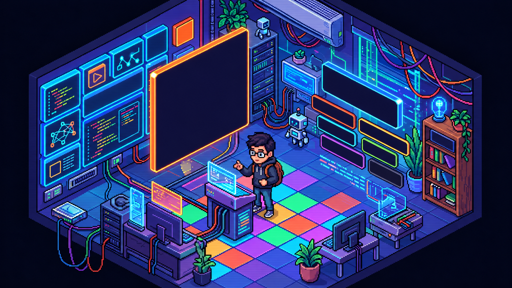

# 🎮 Christian Pinal | Dev Room



## 👋 Sobre el proyecto

**Dev Room** es mi portafolio personal como **Ingeniero en Sistemas Computacionales y desarrollador Java Full Stack Jr.**

En lugar de crear un portafolio tradicional, decidí representar mi perfil profesional como una **habitación interactiva inspirada en videojuegos**, donde cada elemento forma parte de la experiencia.

Desde la habitación puedes explorar mis proyectos, habilidades, trayectoria profesional, información de contacto y algunos detalles ocultos.

> `PLAYER 01 — CHRISTIAN PINAL CORDERO`  
> `CURRENT MISSION — JAVA FULL STACK JR.`

---

## 🚀 Características

- 🎮 Interfaz inspirada en videojuegos.
- 🧭 Navegación interactiva por diferentes zonas de la habitación.
- 💻 Terminal con información profesional.
- 🧩 Sección interactiva de habilidades técnicas.
- 📂 Panel de proyectos con acceso directo a sus repositorios.
- 🔍 Sistema de cámara con acercamiento a cada sección.
- ✨ Animaciones y partículas de neón.
- ⏸️ Opción para pausar las animaciones.
- 📱 Diseño adaptable a diferentes tamaños de pantalla.
- ♿ Navegación mediante teclado y elementos de accesibilidad.
- 📄 Descarga directa de mi CV.
- 🐶 Easter egg oculto de **Morona**, la guardiana del código.

---

## 🛠️ Tecnologías utilizadas

El portafolio fue desarrollado sin frameworks, utilizando tecnologías web fundamentales:

### Frontend

- HTML5
- CSS3
- JavaScript
- DOM
- Diseño responsivo

### Herramientas

- Git
- GitHub
- Visual Studio Code
- GitHub Pages

---

## 🗺️ ¿Cómo explorar Dev Room?

La habitación cuenta con diferentes áreas interactivas.

### 📂 Proyectos

La pared izquierda funciona como un selector de misiones.

Actualmente incluye:

**01 — Rutta**  
E-commerce orientado a amantes del senderismo, desarrollado como proyecto colaborativo.

**02 — Gryffindor Resistance**  
Proyecto frontend realizado durante un hackathon, trabajando con JavaScript, Bootstrap, Git y GitHub.

**03 — Ocarina of Time**  
Sitio web temático desarrollado para practicar HTML semántico, CSS, Bootstrap y diseño responsivo.

**04 — Catálogo con API**  
Proyecto enfocado en JavaScript asíncrono, consumo de APIs, manipulación del DOM y eventos.

Cada proyecto permite consultar una descripción, las tecnologías utilizadas y acceder directamente a su repositorio.

---

## ⚡ Skills

Dentro de la habitación también puedes consultar algunas de las tecnologías que forman parte de mi stack:

- Java
- Spring Boot
- SQL
- HTML5
- CSS3
- JavaScript
- Bootstrap
- Git
- GitHub

Además, continúo desarrollando conocimientos relacionados con desarrollo Full Stack y buenas prácticas de programación.

---

## 💻 Terminal

La computadora dentro de Dev Room funciona como una terminal interactiva desde la cual puedes consultar:

- 👤 Perfil
- 🧭 Trayectoria
- ⚡ Skills
- 📬 Contacto
- 📄 CV

La información se muestra dinámicamente sin abandonar la habitación.

---

## 🐶 ¿Has encontrado a Morona?

Dev Room también tiene un pequeño secreto.

En algún lugar de la habitación se encuentra **Morona**, una husky café encargada de vigilar el código.

Si logras encontrarla podrás desbloquear:

```text
SECRETO DESCUBIERTO · 01/01
```

Y, por supuesto, también puedes darle una caricia. ❤️

---

## 📁 Estructura del proyecto

```text
MiPortafolio-DevRoom/
│
├── assets/
│   ├── Christian-Pinal-CV.pdf
│   ├── morona.png
│   └── room-integrated.png
│
├── index.html
├── style.css
├── data.js
├── app.js
└── README.md
```

### `index.html`

Contiene la estructura principal de la habitación y sus elementos interactivos.

### `style.css`

Controla el diseño visual, posicionamiento, animaciones, efectos de iluminación, transiciones y adaptación a diferentes pantallas.

### `data.js`

Contiene la información de proyectos, habilidades, trayectoria profesional y diferentes paneles mostrados dentro de la terminal.

### `app.js`

Controla la interacción del portafolio:

- navegación por la habitación;
- sistema de cámara;
- selección de proyectos;
- terminal;
- skills;
- partículas;
- animaciones;
- accesibilidad;
- easter egg de Morona.

---

## 🎯 Objetivo

Este proyecto busca representar no solamente mis conocimientos técnicos, sino también mi forma de entender el desarrollo:

**aprender, experimentar, construir y mejorar continuamente.**

Actualmente mi objetivo profesional es incorporarme como **Java Full Stack Jr.**, participar en proyectos reales y continuar desarrollando experiencia en frontend, backend, bases de datos y trabajo colaborativo.

---

## 🔗 Contacto

**Christian Pinal Cordero**  
Ingeniero en Sistemas Computacionales  
Java Full Stack Jr.

- GitHub: [ChrisPort12](https://github.com/ChrisPort12)
- LinkedIn: [Christian Pinal Cordero](https://www.linkedin.com/in/christian-pinal-cordero-575a60327/)

---

## 👾 Estado del jugador

```text
PLAYER ............ CHRISTIAN PINAL
CLASS ............. SOFTWARE DEVELOPER
SPECIALIZATION .... JAVA FULL STACK JR.
LOCATION .......... METEPEC, MÉXICO
STATUS ............ LEARNING & BUILDING
NEXT MISSION ...... FIRST DEV OPPORTUNITY
```

---

⭐ **Gracias por visitar Dev Room.**

```text
> Sigue explorando...
> Tal vez aún quede algún secreto por descubrir.
```